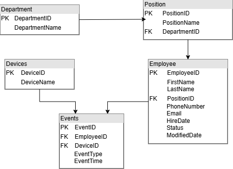

# Generator syntetycznych danych do sytemu Rejestracji Czasu Pracy
-- zdjęcie z bazy danych połączonych tabel--
## Spis treści

* [O projekcie](#o-projekcie)
* [Główne funkcje](#główne-funkcje)
* [Generowane dane](#generowane-dane)
* [Ustawienia konfiguracji](#ustawienia-konfiguracji)
* [Technologie i narzędzia](#technologie-i-narzędzia)
* [Jak uruchomić](#jak-uruchomić)

## O projekcie

Program ten powstał jako część większego projektu. Więcej o nim można przeczytać [tutaj](https://github.com/BartekSliwinski/Transformacja_danych_pomiedzy_systemami_RCP).

Jego zadaniem jest generowanie realistycznych danych w formie plików .csv, 
<!-- aaa -->

## Główne funkcje

## Generowane dane


| Plik | Opis |
|---|---|
| departments.csv | Lista działów w firmie |
| positions.csv | Stanowiska przypisane do konkretnych działów |
| employees.csv | Dane pracowników  |
| devices.csv | Urządzenia rejestrujące wydarzenia |
| worklogs.csv | Zdarzenia wejścia i wyjścia pracowników |

## Ustawienia konfiguracji

## Technologie i narzędzia

* **Język:** Python 3.13
* **Biblioteki:** Pandas, Faker <!--dac reszte-->

---
## Jak uruchomić

### Wymagania wstępne

Upewnij się, że masz zainstalowane:

- **Python 3.10** lub nowszy
- **pip** (menedżer pakietów)

### Instalacja i uruchomienie

1. Klonowanie repozytorium Github:

    ```bash
    git clone https://github.com/BartekSliwinski/Transformacja_danych_pomiedzy_systemami_RCP.git
    cd Transformacja_danych_pomiedzy_systemami_RCP/generator
    ```
2. Stwórz środowisko wirtualne

   - Linux/MacOS:

     ```bash
     python -m venv venv
     source venv/bin/activate
     ```
   - Windows:

     ```bash
     python -m venv venv
     venv\Scripts\activate
     ```
3. Zainstaluj wymagane pakiety:

    ```bash
    pip install -r requirements.txt
    ```
4. Uruchom aplikację:

    ```bash
    python main.py
    ```